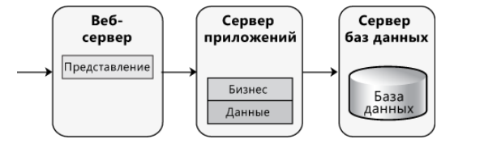
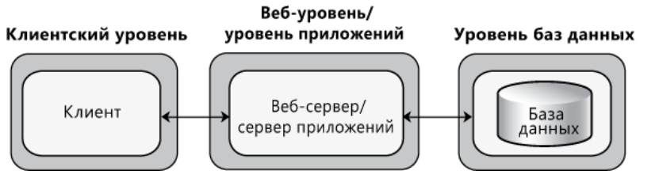
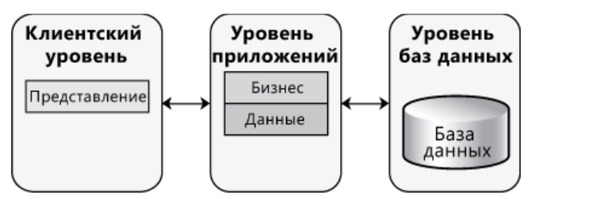
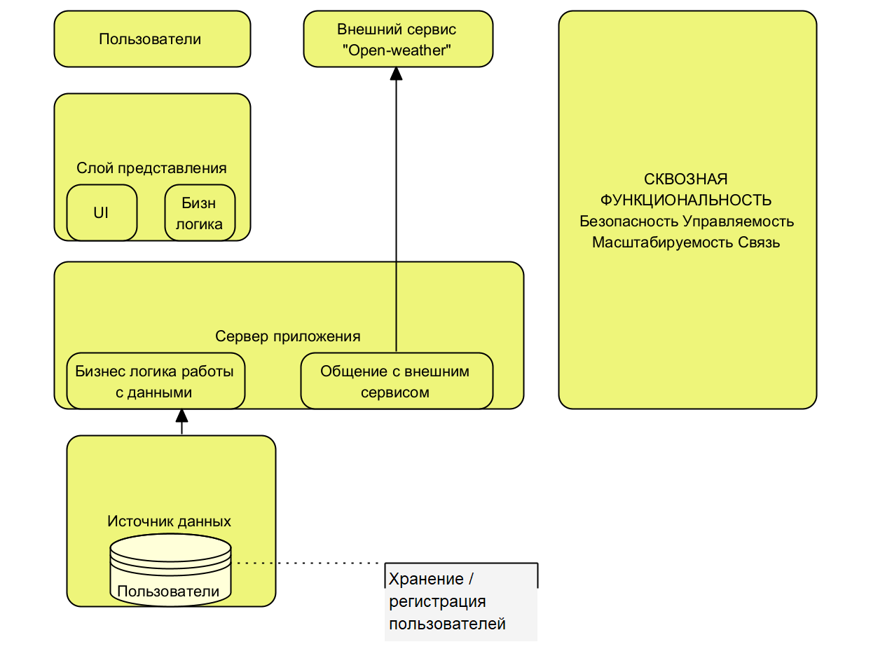
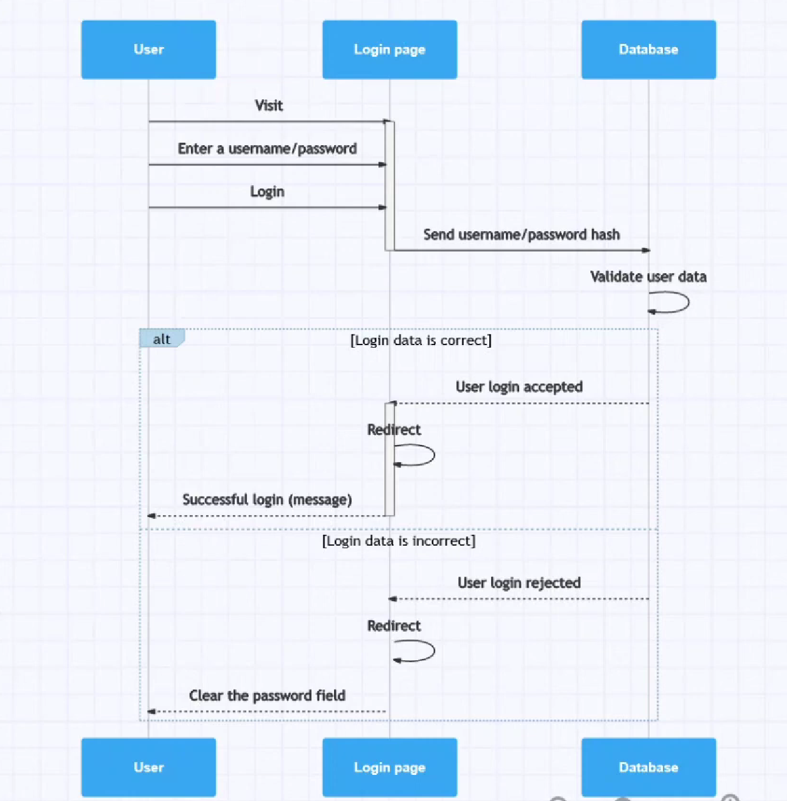

# Документация к проблеме "Software Architecture"
В данном документе описаны решения [__проблемы, связанные с вопросами архитектуры ПО__](https://github.com/MichaelSemenov/Weather-app-viewer/issues/11) для проекта "Weather-app-viewer".

## Часть №1 (___Проектирование архитектуры___)
Согласно документу [Руководству Microsoft по моделированию приложений](https://cdn.discordapp.com/attachments/1146415288385015818/1202877423314796564/Lab3.pdf?ex=65fd3266&is=65eabd66&hm=983b638886c3bacb5d1b8381b25dadf4d560fa43d784c981b24d36ae80647c11&) для разрабатываемой системы были определены следующие характеристики данного ПО:
+ Web-приложение для выполнения преимущественно на сервере в сценариях с постоянным подключением, клиентский UI-интрефейс для взаимодействия клиента-сервера
+ Существует два вида развертывания:
    + ~~Нераспределенное развертывания (развертывание, при котором вся функциональность и все слои приложения, кроме функциональности хранения данных, распологаются на одном уровне)~~
    + - [x] Распределенное развертывание, где все слои распологаются на разных физических уровнях
  
  В данном случае используется шаблон 3-уровневое развертывание, в котором клиент взаимодействует с кодом приложения, развертнутым на другом сервере, и сервер приложений, который взаимодействует с базой данных, размещенной на отдельном сервере, как показано на на рисунке ниже:
  
  Также следует отметить, что в данной реализации используется развертывание насыщенного клиента, бизнес слой которого размещен на уровне приложения, как показано на рисунке ниже:
  
  
+ В данном проекте используются следующие технологии:
  + Spring frameworks
  + React / js
  + Node / js
  + PostgreSQL
    + Данные технологии преимущественно используются в настоящее время для разработки ПО. Также данные технологии соответствуют качествам маштабируемости, безопасности и управляемости.
+ При разработке ПО в данном случае рассматриваются следующие показатели качества:
  + Безопасность
  + Производительность
  + Простота
  + Удобство 
Данные показатели являются свойствами системы, определенные от ее функциональности. Данные показатели удостовряют, что данная система является хорошей. Данные показатели проверены как и во времени, так как под средством проверки.
+ Пути реализации сквозной функциональности следующие:
  + Аутентификация / Авторизация (HHTP запросы, REST API, стэк протоколов TCP/IP)
  + При работе с БД: jdbc statement / jdbc preparedstatement / jdbc template / jdbc hibernate
+ Структурная схема приложения (UML-диаграмма):

___
## Часть №2 (___Анализ архитектуры___)
 В данном анализе покажем архитектуру регистрации пользователей для просмотра погода, на рисунке ниже изображена данная концепция:
 
 ___
 ## Часть №3 (___Сравнение и рефакторинг___)
На данном этапе сравнения архитектур "As is" и "To be" следует отметить, что архитектура "To be" описывает общую концепцию реализации Web-приложения, а "As is" демонстрирует логику реализации Back-end состоявляющей общения между серверами для регистрации и авторизации пользователей.
В данном случае возможным улучшением данной архитектуры является использование __внешнего__ или __внутреннего__ сервиса для шифрования данных.

