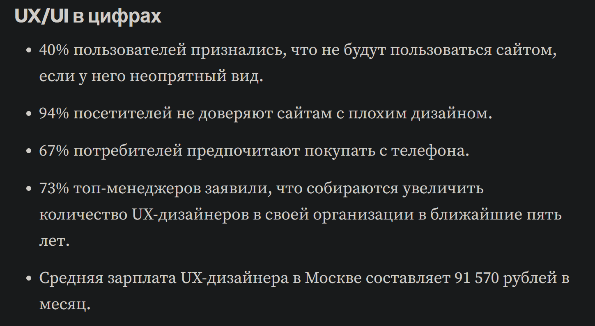
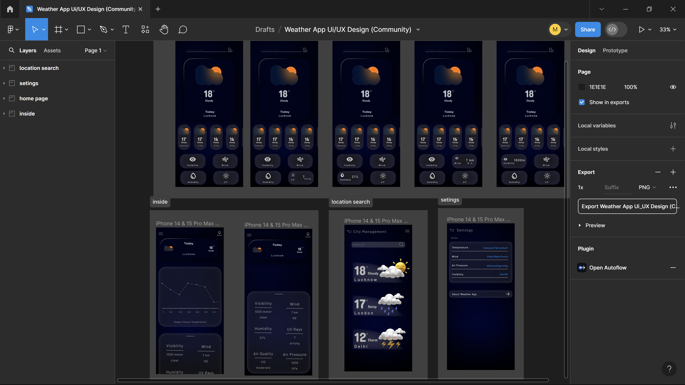
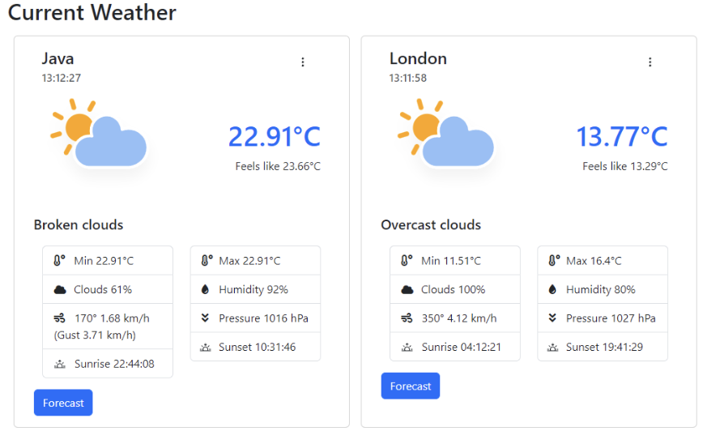
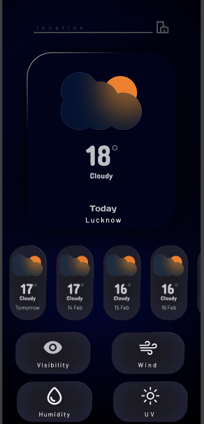

# Улучшение UX в рамках исходного проекта
> В рамках литературы для данного проекта использовалась [статья по атрибутам качества ПО группы "Isability"](https://www.iso.org/obp/ui/?_escaped_fragment_=iso:std:35733:en):
## Оценка разрабатываемого ПО (оценка по 6 атрибутам, согласно определению)
* ___Защита от ошибок пользователя___
```
Под защитой от ошибок пользователя понимают степень, в которой система защищает пользователей от ошибок. В данном проекте на стороне сервера присутствуют обработчики событий и ошибок, что позволяет в случае неправильного вззаимодействия пользователя, ввода неправильных данных корректно обрабатывать данное исключения и правильно вывести пользователю для понимания. Программа аварийно не завершается.
```
* ___Эстетика пользовательского интерфейса___
```
Данное качество называют еще как `Эстетика GUI`. Степень, в которой пользовательский интерфейс обеспечивает приятное и удовлетворительное взаимодействие для пользователя, используются цвета и характер графического дизайна. Так как данный проект реализован как Web приложение, то использовались HTML-разметка и CSS-стили для внешнего отображения сайта. Так же следует отметить, что присутствует адаптивность при изменении размера отображения окна просмотра погоды. 
```
* ___Доступность___
```
Степень, в которой продукт или система могут быть использованы людьми с широчайшим спектром характеристик и возможностей для достижения данной цели в определенном контексте использования. Данный проект разработан и протестирован в рамках локального размещщения, весь функционал работает без замечаний, что делает его доступным. Однако следует отметить, что погоду просматривать могут не все пользователи, только те, которые прошли регистрацию.
```
* ___Используемость (операбельность)___
```
Степень, в которой продукт или система обеспечивает функции, отвечающие заявленным или подрузамеваемым потребностям, а не функциональной спецификации. По техническим требованиям продукт выполняет все должные функции  и требования. В данном проекте возлагались две основные потребности: регистрация/авторизации и запрос/обработка данных на внешний источник с целью получения погоды. Данные проект изменениям подвергать изменениям можно, исходный код открыт (open source).
```
* ___Обучаемость___
```
Степень, в которой продукт или ссистема могут быть использованы определенными пользователями для достижения определенных целей обучения использования продукта или системы с эффективностью, результативностью, свободой от риска и удовлетворением в определенном контексте использования. Данные проект не имеет тяжелый UX для взаимодействия пользователя и Web ресурса. Данные проект предполагает легкость в обучении и понятии принципа работы на сайте, и самое важный аспект - время обучения, что займет малое время на поднятии навыков. 
```
* ___Распознаваемость соответствия___
```
Степень, в которой пользователи могут распознать, подходит ли им продут или система для их нужд. Так как ресурс без замечаний выполняет все поставленные задачи по его функционалу, то пользователю вероятнее всего будет удобен данный ресурс для просмотра погоды.
```
## Выбор путей для улучшения UX, обоснование необходимости
> После изучения важности UI и UX процессы и инструменты при разработке дизайна и последовательности действий согласно [статьи, об UI/UX дизайне](https://medium.com/design-pub/%D1%87%D1%82%D0%BE-%D1%82%D0%B0%D0%BA%D0%BE%D0%B5-ux-ui-%D0%B8-%D0%BF%D0%BE%D1%87%D0%B5%D0%BC%D1%83-%D0%BE%D0%B1-%D1%8D%D1%82%D0%BE%D0%BC-%D0%B2%D1%81%D0%B5-%D0%B3%D0%BE%D0%B2%D0%BE%D1%80%D1%8F%D1%82-a5dbebd7e311), было принято разработать новый UI дизайн для мобильный приложений (так как 63% пользователей преимущественно используют мобильные технологии). Ниже представлены цифры по значению UI/UX для пользователей:

## Этап улучшения UI/UX
> В данной случае улучшение заключается в изменениях wireframe-ов используетя приложение для разработки дезайна `Figma`. Ниже представлен концепт разработки:

В данно случае оперируемся на переход сайта на мобильное приложение.
## Сравнения UI/UX до/после разработки
> __Разработанный внешний вид сайта до:__

> __Разработанный внешний вид сайта после:__

## Вывод: разработка UI/UX состовляющих продукта в настоящее время необходимое направление. Следует разрабатывать ПО не только исходя задаче по выполнению функциона продукта, но так же взаимодействия пользователя. Следует обращать внимания на развития тенденций и потребностей пользователя на внешний мир.